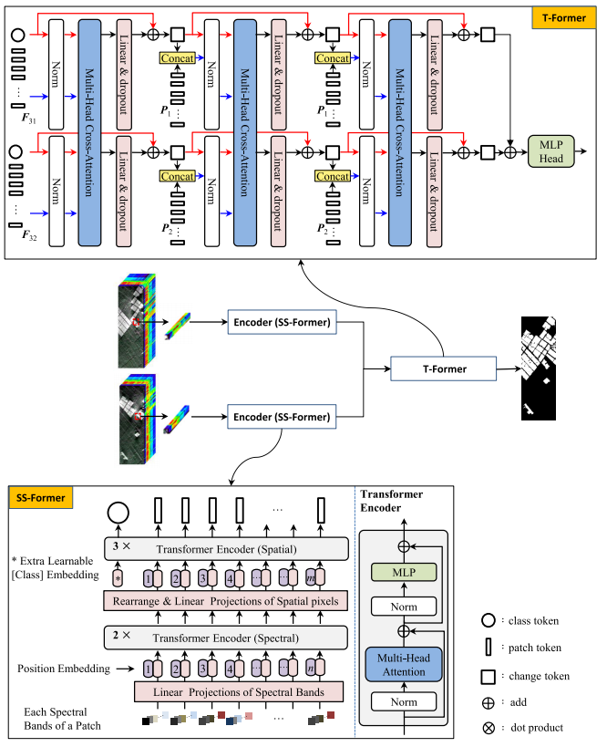

# Spectral–Spatial–Temporal Transformers for Hyperspectral Image Change Detection
The code in this toolbox implements the ["Spectral–Spatial–Temporal Transformers for Hyperspectral Image Change Detection"](https://ieeexplore.ieee.org/abstract/document/9870837). 

Citation
---------------------

**Please kindly cite the papers if this code is useful and helpful for your research.**

    @article{9870837,
      title={Spectral–Spatial–Temporal Transformers for Hyperspectral Image Change Detection},
      author={Wang, Yanheng and Hong, Danfeng and Sha, Jianjun and Gao, Lianru and Liu, Lian and Zhang, Yonggang and Rong, Xianhui},
      journal={IEEE Trans. Geosci. Remote Sens.},
      year={2022},
      volume={60},
      number={},
      pages={1-14},
      note = {DOI: 10.1109/TGRS.2022.3203075}
    }
    
    
How to use it?
---------------------
python demo.py --dataset='farmland'
